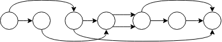

.. _concepts:

Concepts
========

As a framework, Timeflux enables the creation of **applications** that interact with **time series**. According to `Wikipedia <https://en.wikipedia.org/wiki/Time_series>`_, "*a time series is a series of data points indexed in time order*".

Applications are defined by an ensemble of processing steps, called **nodes**, which are linked together using a simple `YAML <https://yaml.org>`_ syntax. In order to be valid, an application must satisfy the requirements of a **directed acyclic graph** (DAG), that is, a set of nodes connected by edges, where information flows in a given direction, without any loop.

Multiple DAGs are authorized within the same application, optionally communicating with each other using one of the available network protocols. DAGs run simultaneously at their own adjustable **rate**. Within each DAG, nodes are executed sequentially according to the topological sorting of the graph.

    An example directed acyclic graph (DAG), arranged in topological order. Circles represent **nodes**, arrows are **edges**. The connection points between nodes and edges are called **ports**. Information flows from left to right, at a frequency defined by the graph rate.

Nodes may expect one or more **inputs** and may provide any number of **outputs**. These I/O have two main properties. The **data** property is either a `datetime`-indexed `Pandas DataFrame <https://pandas.pydata.org>`_, or an `Xarray <http://xarray.pydata.org/en/stable/>`_ structure with at least two dimensions: time and space. The **meta** property is a dictionary containing arbitrary keys, which can be used for example to indicate a stream nominal rate or to describe the context associated with an event.

There are different types of **ports** that may impact how an application is written:

- **Default ports** -- Each node has one implicit input port and one implicit output port. If a node is expecting only one input, it will be on the default input port. If a node is providing only one output, it will be on the default output port.
- **Named ports** --  If a node is expecting more than one input or is providing more than one output, it will explicitely define ports. These ports are identified by a name.
- **Dynamic ports** -- They work just like named ports, except they are defined on the fly, according to the context.
- **Numbered ports** -- In some cases, the number of inputs or outputs cannot be known in advance. For example, an epoching node running at a low rate may need to output an arbitrary number of `DataFrame`\s during each execution.

.. note::

    This is all there is to know to understand how Timeflux works. Confused? Don't worry. In the next sections, we will discuss a few examples in details and all this will soon make sense. You will be able to design your own application from scratch in no time!
