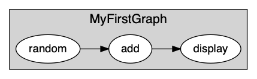
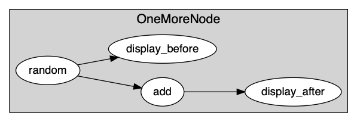
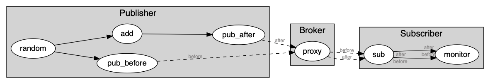

.. _hello_world:

Hello, World!
=============

Let's get our feet wet! You will now write your first application, and progressively extend its capabilities.

Timeflux apps are written in YAML. If you don't know anything about YAML, we recommend to first spend three minutes watching this `introduction video <https://www.oreilly.com/learning/introduction-to-yaml>`_.

For this app, we will use a node that comes from the `timeflux_example <https://github.com/timeflux/timeflux_example>`_ plugin. The installation is straightforward:

.. code-block:: bash

    conda activate timeflux
    pip install timeflux_example

For your first iteration, here is what you will build:

This is a very simple app with one graph and three nodes. The first node generates random time series, sends its output to another node that adds 1 to each value of the matrix, and that itself sends its own output to a debugging node.

Open a code editor, and copy-paste the following:

.. code-block:: yaml

    graphs:
      - id: MyFirstGraph
        nodes:
        - id: random
          module: timeflux.nodes.random
          class: Random
          params:
            columns: 5
            rows_min: 1
            rows_max: 10
            value_min: 0
            value_max: 5
            seed: 1
        - id: add
          module: timeflux_example.nodes.arithmetic
          class: Add
          params:
            value: 1
        - id: display
          module: timeflux.nodes.debug
          class: Display
        edges:
        - source: random
          target: add
        - source: add
          target: display
        rate: 1

Save the file as `helloworld.yaml`, and run the app (don't forget to activate the `timeflux` environment if it is not already the case!):

.. code-block:: bash

    timeflux -d helloworld.yaml

Interrupt with `Ctrl+C`.

Let's take a step back and examine the code. The first thing we notice is the ``graphs`` list. Here, we only have one graph. Graphs have four properties:

- ``id`` -- This is not mandatory, but very useful when you have more complex applications. Each time something is logged in the console, the graph ``id`` will be printed, so you know exactly where it comes from.
- ``nodes`` -- This is the list of individual computing units in our graph.
- ``edges`` -- This is where you connect the nodes together.
- ``rate`` -- The frequency of the rate. A value of `25` means that each node in the graph will be executed 25 times per second. The default value is `1`, so here, we could have omitted it.

Nodes have also four properties:

- ``id`` -- A unique identifier for the node. Unlike graph ``id``\s, node ``id``\s are mandatory.
- ``module`` -- The name of the Python module where the node is defined.
- ``class`` -- The name of the Python class that defines the node.
- ``params`` -- A dictionary of parameters passed during the initialization of the node.

The list of parameters and their meaning can be found in the API documentation. In our case:

- :meth:`timeflux.nodes.random.Random`
- :meth:`timeflux_example.nodes.arithmetic.Add`
- :meth:`timeflux.nodes.debug.Display`

Edges connect nodes together. They have two properties, ``source`` and ``target``. Each of them takes a node ``id`` as value. Here we connect the default output to the default input, so we don't need to specify the port name. We will see how to connect I/O to named and dynamic ports in a moment.

Right now, we have a very simple app that prints the modified matrix in the screen. What if we want to *also* display the original matrix *before* we add 1?

This can be represented schematically as:

And in YAML as:

.. code-block:: yaml

    graphs:
      - id: OneMoreNode
        nodes:
        - id: random
          module: timeflux.nodes.random
          class: Random
        - id: add
          module: timeflux_example.nodes.arithmetic
          class: Add
          params:
            value: 1
        - id: display_before
          module: timeflux.nodes.debug
          class: Display
        - id: display_after
          module: timeflux.nodes.debug
          class: Display
        edges:
        - source: random
          target: add
        - source: random
          target: display_before
        - source: add
          target: display_after

We just added one ``Display`` node and one edge. For brevity, we also removed the ``params`` property of the ``Random`` node and used the default values.

All this console printing is boring. We want glitter and unicorns! Or at least, we want to display our signal in a slightly more graphical way. Enters the `timeflux_ui <https://github.com/timeflux/timeflux_example>`_ plugin. This plugin enables the development of web interfaces, and exposes a JavaScript API to interact with Timeflux instances through WebSockets. Bidirectional streaming and events are supported, as well as stimulus scheduling with sub-millisecond precision. A monitoring interface is included in the package.

Without further ado, let's install it:

.. code-block:: bash

    pip install timeflux_ui

We need to refactor our code a little bit. For better performances (and also for readability), it is a good practice to divide the code into multiple graphs. Remember that nodes inside a graph run sequentially and that graphs inside an application run in parallel.

Of course, in our simple example, we could get away with only one graph, but this is an opportunity to introduce a fundamental notion: inter-graph communication. To send and receive information between nodes from different graphs, we can use any of the asynchronous network nodes provided with Timeflux. If you come from the Brain-Computer Interface field, you probably already know about the `Lab Streaming Layer <https://github.com/sccn/labstreaminglayer>`_ system. We have nodes for that (see: :mod:`timeflux.nodes.lsl`). Here we will use a `Publish/Subscribe` protocol, built on top of the `ZeroMQ <https://zeromq.org>`_ library, and available in the :mod:`timeflux.nodes.zmq` module. In the `Pub/Sub` pattern, subscribers express interest in topics, and receive data matching these topics. There can be more than one publisher per topic. Our implementation provides a broker that centralizes messages emitted by publishers.

This will look like this:

It can be rendered in YAML as follows:

.. code-block:: yaml

    graphs:

      - id: Broker
        nodes:
        - id: proxy
          module: timeflux.nodes.zmq
          class: Broker

      - id: Publisher
        nodes:
        - id: random
          module: timeflux.nodes.random
          class: Random
          params:
            columns: 2
            seed: 1
        - id: add
          module: timeflux_example.nodes.arithmetic
          class: Add
          params:
            value: 1
        - id: pub_before
          module: timeflux.nodes.zmq
          class: Pub
          params:
            topic: before
        - id: pub_after
          module: timeflux.nodes.zmq
          class: Pub
          params:
            topic: after
        edges:
        - source: random
          target: add
        - source: random
          target: pub_before
        - source: add
          target: pub_after

      - id: Subscriber
        nodes:
        - id: sub
          module: timeflux.nodes.zmq
          class: Sub
          params:
            topics: [ before, after ]
        - id: monitor
          module: timeflux_ui.nodes.ui
          class: UI
        edges:
          - source: sub:before
            target: monitor:before
          - source: sub:after
            target: monitor:after

What changed:

- We added a graph called `Broker` with only one node. Its role is to centralize the messages. It acts as a proxy between publishers and subscribers.
- Our main graph is now called `Publisher`. We replaced the ``Display`` nodes by ``Pub`` nodes. Notice that these nodes take one parameter: ``topic``.
- A third graph named `Subscriber` was introduced. The ``Sub`` node subscribes to the two existing topics. The ``UI`` node is responsible for handling the web server and displaying the data. The ``Sub`` node has dynamic output ports, meaning that it will create output ports on the fly, named after the ``topics`` parameter. The ``UI`` has  dynamic input ports, created automatically according to the second part of the ``target`` property of the edges. ``sub:before`` to ``monitor:before`` means: *connect the* ``before`` *output port of the* ``sub`` *node to the* ``before`` *input port of the* ``monitor`` node*.

Launch the app, and visit `http://localhost:8000/monitor <http://localhost:8000/monitor>`_ in your browser. From the `Streams` panel, select one signal, then select the channel you want to display (or choose `all channels`). Click the `Display` button, and voilà!

.. note::

    Agreed, this first application does not do anything useful. But by now, you have grasped the essential concepts and are well on your way to a real-world app!