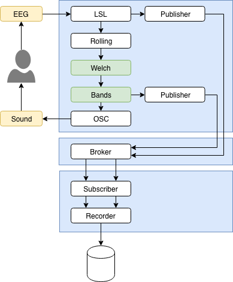

A neurofeedback app
===================

Let's apply what we learned and build a simple alpha neurofeedback app.

.. tip::

    This use case assumes a little bit of background in EEG processing. If this is not the case for you, focus on the data flow rather than the processing itself, and make sure that you understand the syntax.

.. note::

    This example does not include the sound generation. This can be accomplished with any multimedia programming software that understand the `Open Sound Control <http://opensoundcontrol.org/introduction-osc>`_ protocol, such as `Pure Data <https://puredata.info>`_ or `Max <https://cycling74.com>`_.

The application consists of three graphs. In the main one, we assume that the EEG data is acquired through a LSL inlet. Data is accumulated into a rolling window, on which the classical `Welch’s method <https://en.wikipedia.org/wiki/Welch%27s_method>`_ is applied with default parameters. The frequency bands are then extracted from the periodogram. Finally, the relative alpha power is sent to an OSC outlet. An external application receives this data and plays a sound when the feedback signal crosses a defined threshold. The other two graphs are not strictly required, but illustrate some important principles. The graph containing the Broker node acts as a proxy. It receives data from publishers (in our example, the raw EEG stream and the computed frequency bands) and redistributes it to subscribers. In the last graph, these two data streams are aggregated and saved to a HDF5 file.

    Schematic representation of a basic neurofeedback application. Each blue box is a DAG. Together, they constitute the Timeflux application. The white boxes are core nodes. The green boxes are plugin nodes. Yellow boxes indicate external components.

The whole application is expressed in YAML as follows:

.. code-block:: yaml

    graphs:

      # The publish/subscribe broker graph
      - id: PubSubBroker
        nodes:
        # Allow communication between graphs
        - id: Broker
          module: timeflux.nodes.zmq
          class: Broker

      # The main processing graph
      - id: Processing
        nodes:
        # Receive EEG signal from the network
        - id: LSL
          module: timeflux.nodes.lsl
          class: Receive
          params:
            name: signal
        # Continuously buffer the signal
        - id: Rolling
          module: timeflux.nodes.window
          class: Window
          params:
            length: 1.5
            step: 0.5
        # Compute the power spectral density
        - id: Welch
          module: timeflux_dsp.nodes.spectral
          class: Welch
        # Average the power over band frequencies
        - id: Bands
          module: timeflux_dsp.nodes.spectral
          class: Bands
        # Send to an external application
        - id: OSC
          module: timeflux.nodes.osc
          class: Client
          params:
            address: /alpha
        # Publish the raw EEG signal
        - id: PublisherRaw
          module: timeflux.nodes.zmq
          class: Pub
          params:
            topic: raw
        # Publish the frequency bands
        - id: PublisherBands
          module: timeflux.nodes.zmq
          class: Pub
          params:
            topic: bands
        # Connect nodes
        edges:
          - source: LSL
            target: Rolling
          - source: Rolling
            target: Welch
          - source: Welch
            target: Bands
          - source: Bands:alpha
            target: OSC
          - source: LSL
            target: PublisherRaw
          - source: Bands
            target: PublisherBands
        # Run this graph 25 times per second
        rate: 25

      # The recorder graph
      - id: SaveToFile
        nodes:
        # Receive data streams from the broker
        - id: Subscriber
          module: timeflux.nodes.zmq
          class: Sub
          params:
            topics:
            - raw
            - bands
        # Record to file
        - id: Recorder
          module: timeflux.nodes.hdf5
          class: Save
        # Connect nodes
        edges:
          - source: Subscriber:raw
            target: Recorder:eeg_raw
          - source: Subscriber:bands
            target: Recorder:eeg_bands
        # Update file every second
        rate: 1

